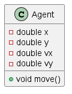
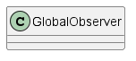
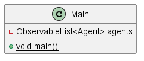

# Architecture

## Agent

The Agent class bundles information about agents including their position and velocity together with relevant methods 
such as a move method. Agents will try to avoid obstacles as they move toward their goal. Each obstacle is modeled as a 
JavaFX Polygon while the goal is modeled as a JavaFX circle.

## GlobalObserver

The GlobalObserver class defines a singleton that watches over the agents and facilitates relevant communications 
among them.

## Main

