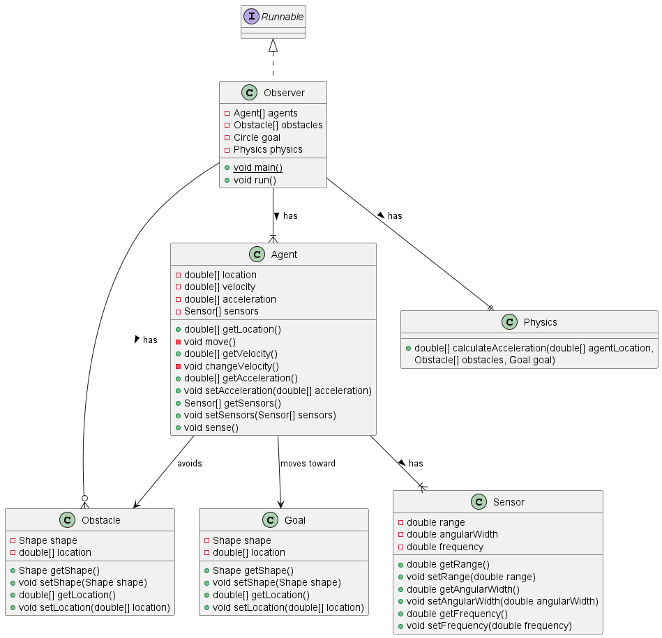

# Architecture

## App

The App will watch over the simulation. It can see all agents, all obstacles, and the goal at all times. When an agent reaches the goal, it will end the simulation.

## Agent

An agent has a location, velocity, and acceleration. It's acceleration will depend on the physics of the simulation.

An agent also has an array of sensors. It will periodically check its sensors to avoid obstacles as it moves toward the goal which it can sense at all times. It will forget about obstacles that it can no longer sense.

## Sensor

A sensor has a range and an angular width that determine what it can see. It also has a frequency at which it will check for obstacles.

## Obstacle

Obstacles stand in the way of the agents as they move toward their goal. They can have any 2D shape and can be located anywhere in the simulation. Obstacles may not overlap.

## Goal

The Goal is the destination that the agents must reach before the simulation can end. It can have any 2D shape and can be located anywhere in the simulation. It may not overlap with obstacles.

## Physics

A model of physics will inform the agents of how to move.