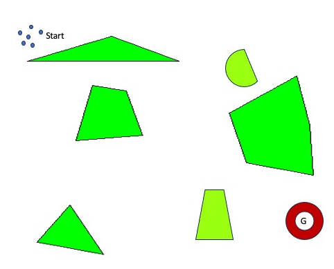

# Deep Evolutionary Learning for Adaptive Swarm Optimization

### Dr. Suranga Hettiarachchi and Mr. Dale Morris

Traditionally, the swarm optimization is done offline, making it a time-consuming approach. In prior work, we have 
demonstrated that swarms can be optimized online using DAEDALUS paradigm. We proposed DAEDALUS as an online adaptive 
swarm optimization paradigm used in collaboration with Physicomimetics approach to swarm control.

In physics-based approaches, virtual physics forces drive a agents and robots to a desired configuration or state. The 
desired configuration is one that minimizes overall system potential energy, and the system acts as a molecular dynamic 
(F = ma) simulation. “Physicomimetics” or artificial physics (AP) is motivated by classical physics. This approach 
provides excellent techniques for distributed control of large collections of mobile physical agents as well as 
theoretical foundations for analyzing swarm behaviors. The Physicomimetics framework provides an effective basis for 
self-organization, fault tolerance and self-repair of robot control.

The DAEDALUS paradigm assumes that agents (whether software or hardware) move throughout some environment. As they move, 
they interact with other agents. These agents may be of the same species or of some other species. Agents of different 
species have different roles in the environment. The goal is to evolve agent behaviors and interactions between agents, 
in a distributed fashion, such that the desired global behavior occurs. Let us further assume that each agent has some 
procedure to control its own actions in response to environmental conditions and interactions with other agents. The 
precise implementation of these procedures is not relevant; thus, they may be programs, rule sets, finite state machines, 
real-valued vectors, force laws, or any other procedural representation. Agents have a sense of self-worth or “fitness”. 
Each agent of the swarm is an individual in a population that interacts with its neighbors. Each agent contains a 
slightly mutated copy of the optimized control procedure found with offline learning with an offline EA. This ensures that 
our agents are not completely homogeneous. We allowed this slight heterogeneity because when the environment changes, 
some mutations perform better than others. The agents that perform well in the environment will have higher fitness than 
the agents that perform poorly. When low fitness agents encounter high fitness agents, the low fitness agents ask for the 
high fitness agent’s rules. Hence, better performing agents share their knowledge with their poorer performing neighbors. 
To ensure the capability of adapting to further changes in the environment, agents also occasionally mutate their own 
rules, according to a predefined mutation rate attached to that agent.

This work explores the possibility of improving adaptive learning capabilities of DAEDALUS paradigm by utilizing Deep 
Evolutionary Learning Networks (DELN) in Physicomimetics domain. DELN has been used in various applications, including 
recommender systems, data encryption, data visualization, pattern recognition, natural language processing, autonomous 
navigation, and financial forecasting systems. Deep Leaning algorithms utilize artificial neural networks (ANN) with 
many hidden layers, hence the depth. These deep hidden layers allow the ANN to automatically learn complex features of 
raw data, making them highly effective.

In this work a swarm of agents in an obstacle laden environment learn utilizing DELN to optimize their Physicomimetics 
based control algorithm rules. The swarm will use DAEDALUS approach to adapt to changing conditions of the environment. 
The environment contains several disjoint polygonal obstacles and a specific goal. The swarm learns to navigate in this 
static environment and reach the goal. The image-1 below shows a possible scenario of the environment with the swarm of 
agents at the start location and goal with a red color circle.

Image-1: An environment with the swarm of agents at the start location and goal with a red circle
